# User_Interface_Project_1

Public webpage: https://nsuer.github.io/User_Interface_Project_1/
Github repo: https://github.com/NSuer/User_Interface_Project_1

To view the documentation with images and video viewable, please visit my github repo.

# Assignment 3: Project check-in

1. Where does your project currently stand?  
  - I have finished all the design work, interviews, and sketches. I have also completed Level 1 and 2 Implementation Goals. I am currently working on Level 3. I already have the ability to change color themes and have set up all the data needed to track goals. I am currently working on implementing and designing the component for goals.

2. What is your plan for completing the project by the deadline?
  - I really don't have that much more to implement. I plan on working on it throughout the week and doing the final documentation and turning it in saturday.

3. To help you space out your work, please attach a draft (or the final) version of your design work
	- All of my design work is below &darr;

# Documentation

## Description of the project
My Religious Journal project is a web page designed to be a religious journaling application. Users have the ability to record their daily religious time. This includes journaling, keeping track of verses, prayer, and reflection activities. Users also have the ability to navigate to previous entries, search for previous entries, see their consistency, set goals, and change themes.

## Interviews

### What do you hope to learn from these interviews?
I hope to learn about how a prospective user would want to use an interface to manage their daily spiritual time. I want to know what features should be included and how I can help them with their needs.

### Questions:

- **What are some activities you do when doing daily spiritual time?**
  - Olivia: Olivia said she likes to pray first. Then she likes to journal in a letter format to god. She usually reflects on her day and thanks God.
  - Carson: Carson said he usually likes to read his bible first. Then he likes to pray. Then finally he journals about both the reading and prayer.

- **What are some needs around seeing your previous entries?**
  - Olivia: Olivia talked about how she would like to see entries from the past because she wants to see what she was writing on big days in her life. I believe this means she would like to go very far in the past, and that is her need. She also wanted to be able to look-up journal entries by writing key words, to be able to look if she journaled about something in the past.
  - Carson: Carson said he would not really look at his previous entries that much. But it wouldn't be a useless thing. He talked about how it would be cool if he could log what parts of the bible he read so that he knows how much of it he's read.

- **How often would you view previous entries?**
  - Olivia: About once a month.
  - Carson: Not much. But would use the verse/reading tracker, whenever he wasn't sure what to read next.

- **What specifically do you want to track?**
  - Olivia: Journal entries and how often, to keep herself accountable.
  - Carson: Parts of the bible read and how often to also keep himself accountable.

- **What do you usually journal about?**
  - Olivia: Letter format to god. About her day and writes prayers.
  - Carson: Reflection on verse he read and prayer for the day.

- **Would you prefer a minimalist or feature-rich application?**
  - Olivia: Minimalist so that she doesn't get distracted.
  - Carson: Doesn't care much but wants a verse tracker.

- **What types of goals would you set for yourself using a tool like this?**
  - Olivia: Consistency.
  - Carson: Reading entire books and consistency.

- **What are your favorite themes to use? (dark mode, light mode, color, etc.)**
  - Olivia: light mode or pink
  - Carson: dark mode or purple

### Findings (What did you learn from them?)
- I learned the activities that they wanted to focus on. These were Journaling, keeping track of verses, prayer, and reflection. Thankfully they were similar to the ones I made for assignment 2.
- I learned the goals they would like to track. These were consistent and verses read.
- I learned what type of interface they would want. Simplistic with dark, light, pink, and purple color themes.
- I learned how often and what they want to see when they view previous entries.

## Design

### Design Goals and Requirements
  - Must be able to quickly be able to see their consistency of journaling.
  - Must be able to switch themes between dark, light, pink, and purple.
  - Must have journaling, keeping track of verses, prayer, and reflection activities.
  - Must have the ability to view previous journal entries.
  - Must have a journal entry search bar ( this is my Level 4 Implementation Goal ).

### Sketching Design Alternatives
I did 10-plus-10 MINUTES, because I was having trouble coming up with more ideas. It said this was allowed in the project instructions.

- **3 interesting design challenges to explore and 10-plus-10 sketches.**
  - Enable the user to select previous entries by date.
	- Alternatives
	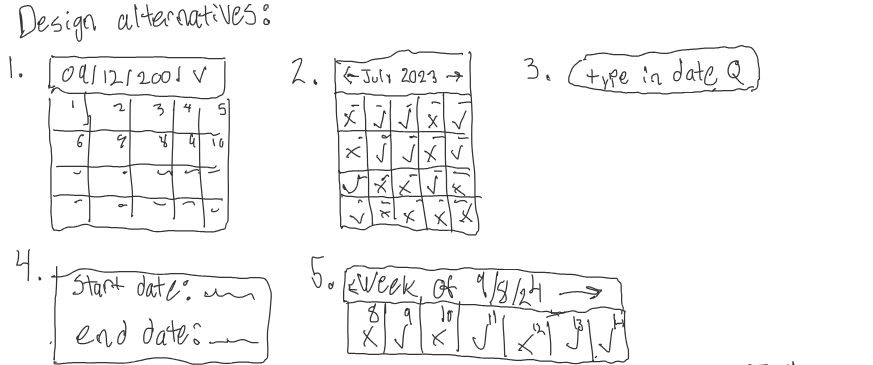
	- Variations
	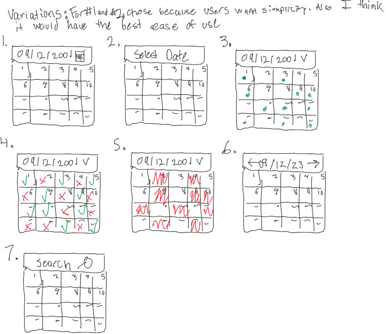
  - Enable the user to quickly see their consistency in a minimalistic and simple way.
	- Alternatives
	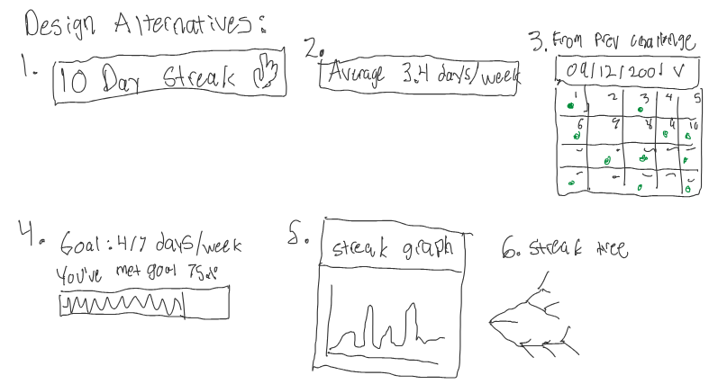
	- Variations
	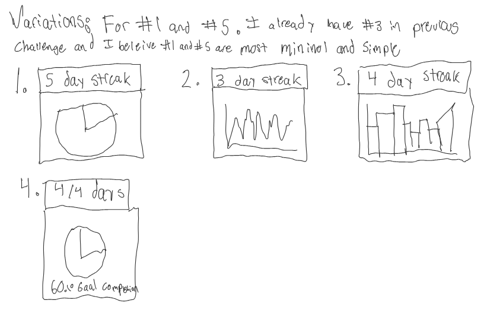
  - Enable the user to change the color theme.
	- Alternatives
	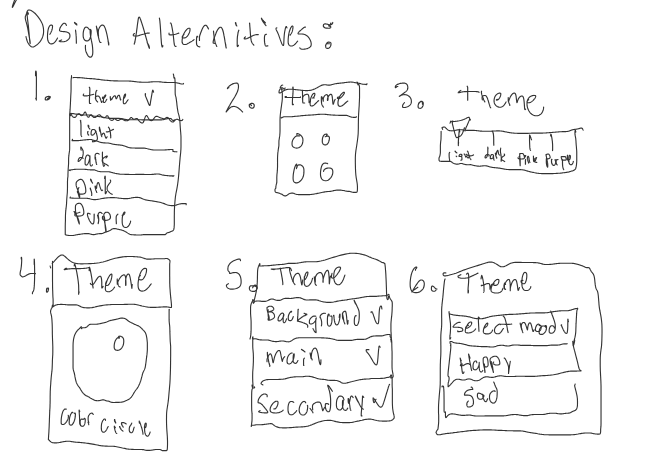
	- Variations
	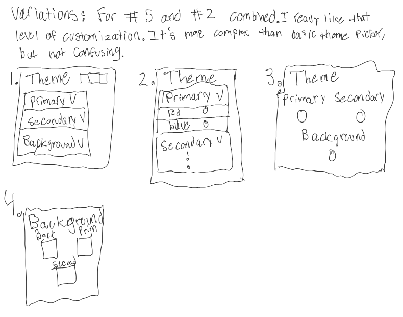

### Prototype Sketch of Envisioned Interface
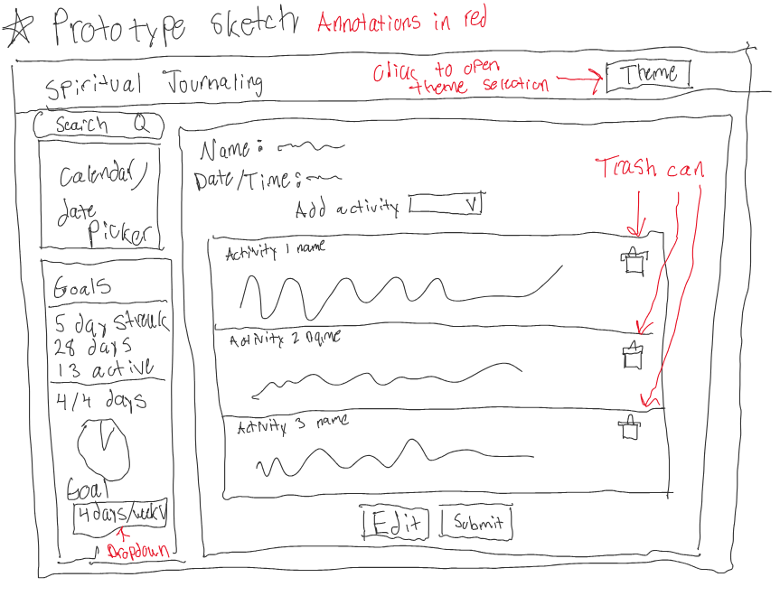

### Feedback for Prototype Sketches from 2 People
- Olivia: She thinks there should be an add activity button rather than just clicking on dropdown. Also that I should come up with a better name.
- Carson: Carson noticed there was no label for the setting goals area and wondered if you could set other goals.

### Mock User Profile
Jane Doe (she/her) is a 20 year old that wants to be more consistent with her daily spiritual time. During that time she likes to read, journal, and pray. Jane Doe wants to use this application as a way to make sure she sticks to her goals with daily spiritual time, she also wants to look at her previous journal entries in the future.

## Description of the interface in detail:
- Activities Section
  - Their name
  - The current date/time
  - When viewing already saved entries, a "Currently Viewing" label will appear letting them know they are at that date
  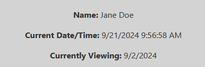
  - Making an entry
    - Users can follow the diections of each activity and input their inf
  - Saving entries
    - Visual feedback will occur upon sucessfully saving
  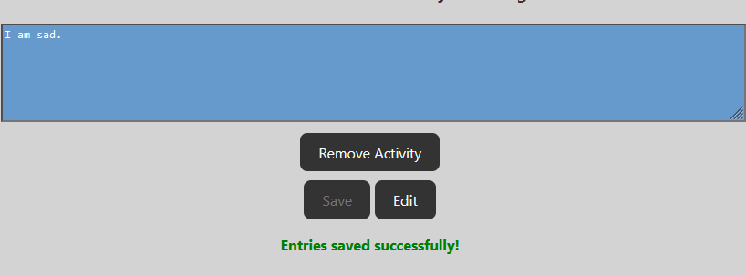
  - Editing entries 
    - Visual feedback will occur upon entering edit mode
  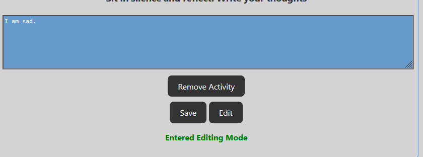
  - Disabling inputs when not being edited 
    - When switching between dates, inputs will be disabled to stop accidental editing
  - Adding activities 
    - Users can select which activities to add, from a list of activites currently removed. This will be mirrored across other dates.
  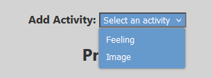
  - Removing activities
    - Users can remove activities. This selection is mirrored across other dates. Data is not deleted in previous entries though. When the activity is added back, the data will still be there.
  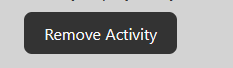
- Click Calendar
  - Viewing previous entries
    - Dates with data will have a green dot. Users can select these dates and see previous entries. When selecting a date that has no data, visual feedback saying there is no data will appear. 
  - Returning to home (Current day)
    - There is a button that returns the user to the current day.
    - The current day is also colored blue in the calnedar
  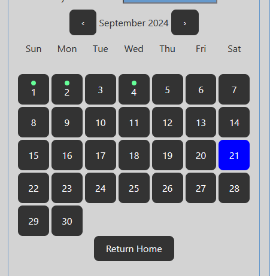
  - Searching for entries (level 4 implementation goal)
    - Users can search for journal entries from a search bar. User can then click the "Go to entry" button to view that entry.
  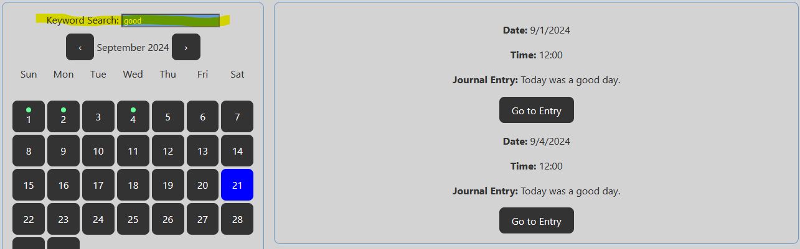
- Goal Area
  - How long they have used the interface and how much they have used the interface (X days since beginning, Y days active)
  - Setting goal
  - Pie graph: visual overview of performance
    - Upon changing the goal, this graph will reactively change to the new goal
  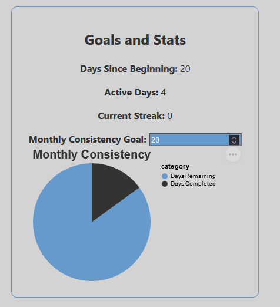
- Theme Picker
  - Allows user to change the colors/theme of the UI by clicking circles (Reverse by clicking through)
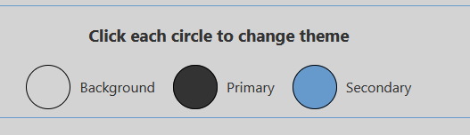

## Implementation of this application
I implemented my project using mostly svelte and js. I had to use ts at only one point, which was to use Vega-Lite. The professor recommended this library, so I assumed doing this was okay. Outside of using svelte and js, the only libraries I used were Vega-Lite and date-fns. Vega-lite was used in my goal section to create the pie graph. Date-fns was used to help me with dates and the calendar. My code structure consisted of my main page, components for each section, and a single store. My main page was used to section off certain areas of the UI to create common regions, similarity, and continuity. Each section was then split into a separate component, so that the code would be more modular and readable. Each component would control its own styling and functionality. The final thing I used in my project was a svelte store. I used this as a sort of global variable hub. This allowed me to have a single place for important variables and also allowed for reactivity between components. An example of these variables would be themes, stored journal entries, and what view/mode the UI is in.

## Use of AI
- Optional- Use of AI-  If you used AI, describe how.  Did you identify strengths/limitations of using AI for your application? Tell your reader how you used an AI tool to help you with your project. Note limitations and places where the AI responses were insufficient.  Comment on whether it was helpful and how.  
- I used chatGPT to convert this documentation from a word document to markdown. This was before I worked on design work though. This was helpful, but the markdown wasn't perfect
- I used github co-pilot as a css debugging tool. I used github co-pilot to explain to me what things did and ask what is causing certain behavior. This was helpful but like 30% of the time it was wrong.
- I used github co-pilot to turn an array structure I had into classes for my activity. This was helpful and it didn't make any mistakes.
- I used github co-pilot to generate my fake data. It was just pattern matching over the classes that were created.
- In general I use github co-pilot. But this usually is just pattern matching and autocomplete so that I can work faster.
- I used chatGPT to get me started on my clickable calendar component. I did this because I didn't know where to start. Here is the prompt I used: "Make me a clickable calendar component using vite + svelte + js. It should be a full year calendar with arrows to navigate between months. It should look in an array called dailyEntries. If there is an entry for that day it should have a green circle, to indicate there is a journal entry. If a date is clicked it should call a function with that date as an argument.". I also gave it my fake data for dailyEntries. An image of what it gave me is below. This was really helpful and it surprised me with what it could do. The most helpful thing honestly was getting date-fns and the functionality working. However the styling was really bad and I still needed to get the previous entry functionality working.
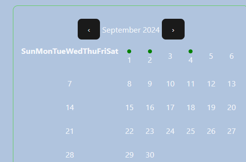
- Used github co-pilot to help me get the color changing in my vega-lite pie graph. It got it right the first time.
    
## Future Work
A verse / what I've read tracker. I believe this would be a large undertaking and would be out of scope for this project. I did not have time to implement this

## Demo Video
https://youtu.be/L80COjKEjEc
### What is covered in video
- Name of project: Religious Journal
- My name: Nathan Suer
- Project Components:
  - Activities Section
  - Click Calendar
  - Goal Area
  - Theme Picker
- How my application works:
  - Info in the "Description of the interface in detail" section of documentation

# Helpful Commands
- `npm run deploy` - This will build and deploy the github page public website
- `npm run dev` - runs site locally